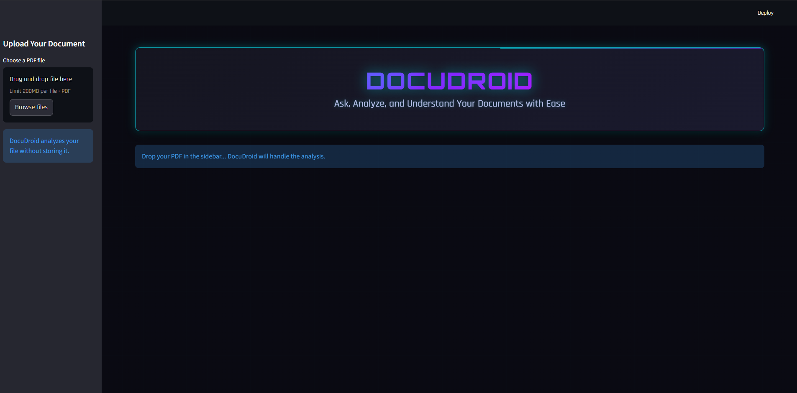
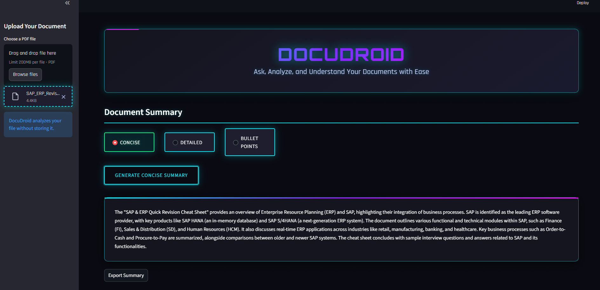
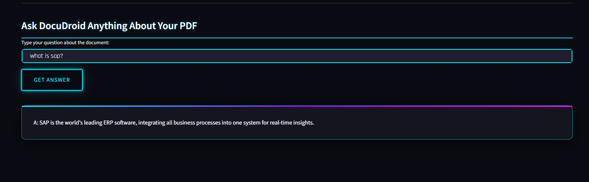

# DocuDroid: RAG-based PDF Analyzer & Semantic Q&A Chatbot

---

  
  

  
[](https://opensource.org/licenses/MIT)

DocuDroid is an intelligent web application built with Python, LangChain, and ChromaDB for **RAG (Retrieval-Augmented Generation) based PDF analysis**. It can summarize PDFs, extract key points, and answer detailed, context-aware questions using semantic search and LLMs.

---

### Images


<br>


<br>

## 

## About The Project

DocuDroid solves the problem of quickly understanding complex PDF documents. Users can upload PDFs and the system will:

- Generate multiple types of summaries
- Extract key bullet points
- Answer questions in a conversational manner

It uses **vector embeddings stored in ChromaDB** to perform semantic search, meaning queries are understood by **meaning, not just keywords**. The interface is fully responsive via Streamlit, and all documents are processed securely in-memory.

---

## Key Features

- **RAG-based Summarization**:

  - **Concise Summary**: Quick overview
  - **Section-wise Summary**: Detailed breakdown
  - **Key Bullet Points**: Critical insights

- **Semantic Q&A**: Ask questions and get context-aware answers

- **Downloadable Output**: Export summaries or answers as .txt files

- **Modern UI**: Streamlit-powered, responsive, and user-friendly

- **Privacy-focused**: Documents are processed locally in-memory

---

## Tech Stack

- **Frontend**: Streamlit
- **Backend & AI**:
  - LangChain for LLM orchestration
  - OpenAI GPT models for semantic understanding
  - ChromaDB for vector storage and semantic search
  - PyPDF for PDF text extraction
- **Data Processing**: pandas
- **Language**: Python
- **Environment Management**: python-dotenv

---

## ⚙️ Setup & Installation

### 1. Clone the repository:

```sh
git clone https://github.com/yourusername/DocuDroid.git
cd DocuDroid
```

### 2. Create and activate a virtual environment:

```sh

python -m venv venv
source venv/bin/activate
```

### 3. Install dependencies:

```sh

pip install --upgrade langchain langchain-community langchain-openai chromadb
pip install --upgrade pypdf pandas streamlit python-dotenv tiktoken
```

### 4. Set up environment variables:

Create a .env file in the root directory:

```sh
OPENAI_API_KEY="YOUR_OPENAI_API_KEY_HERE"
```

5. Run the Streamlit app:

```sh
streamlit run app.py
```

## Contributing

Contributions are welcome! Please follow these steps:

1. Fork the repository.
2. Create a new branch for your feature or bug fix.
3. Submit a pull request with a detailed description of your changes.

---

### Acknowledgements

- Thanks to **Streamlit** for easy Python web apps
- Thanks to **OpenAI** for LLM APIs
- Thanks to **ChromaDB** for semantic search
